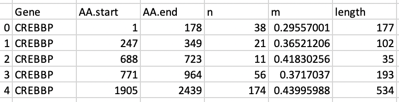
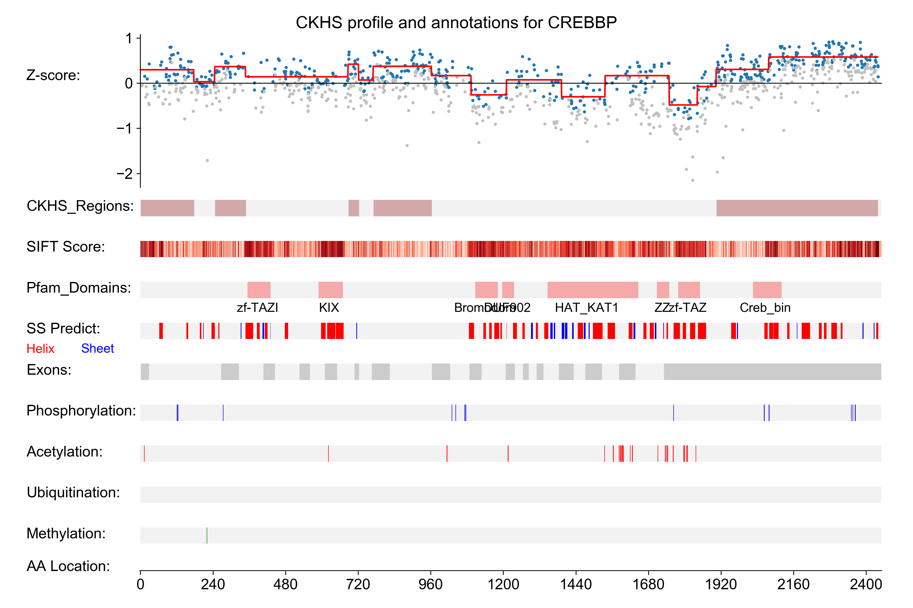

## Note:
```diff
* This is a modified version of ProTiler program to detect hypo-sensitive regions instead of hyper-sensitive regions.
```
# ProTiler (Modified)
## Installation

### Step1: Install Miniconda 3 (Linux)
```console
$ wget https://repo.anaconda.com/miniconda/Miniconda3-latest-Linux-x86_64.sh
$ bash Miniconda3-latest-Linux-x86_64.sh
```

### Step2: Setup channels
```console
$ conda config --add channels r
$ conda config --add channels bioconda
$ conda config --add channels conda-forge
$ conda config --add channels intel
```

### Step3: Install ProTiler 
```console
$ conda create -n Protiler python=3.7 matplotlib=2.2.3 pandas=1.2.0 numpy=1.17.5 seaborn=0.9.0 scikit-learn r-essentials r-base r-stringr r-breakfast=1.0.0
$ conda activate protiler
$ git clone https://github.com/Poirier-Lab/protiler.git
$ cd protiler
$ python setup.py install
```

## Usage 

## Call: Call and visualize HS regions from CRISPR tiling screen data.


### Protiler call take table file(.cvs or .txt) recording CRISPR tiling screen data as input.An example is shown as below: 


### Three colums are required:

- Symbol: This column record the symbol of target gene, for example: 'CREBBP','ACTL6A' 

- AA:  The cutting loci of the corresponding sgRNA at amino acid level

- CRISPR score: the signals for each sgRNA, in the example file, z-scores in three different cell lines are used. User should select at least one column.


###  Arguments of the program:

#### Required arguments:

- -i/--inputfile: 
     
     the file path to the input table recording tiling CRISPR sgRNA annotations and signals. .csv,.txt,.xlsx format are supported 
 
 
- -g/--gene_id: 

     the official symbol of target gene, for example: 'CREBBP','ACTL6A'
 
 
- -s/--score_columns: 

     the column number(s) of input table that recording CRISPR knowckout scores
 
#### Optional arguments:

- -o/--outputdir: 

     the directory name created in the current working directory to save output files, default='ProTilerOutput'
     
- -f/--half_size: 

     The number of neiboring signals from each side selected to filter inefficient sgRNAs',default='5'

- -t1/--threshold: 

     Threshold to supress the outliers among the signals',default='2'

- -t2/--threshold2: 

     Threshold to detect changing points using TGUH method',default='1.5'


### Example to run protiler call

```console
protiler call -i sample.txt -g CREBBP -s 9,10,11 -o ProtilerOutput
```

### Output

#### 1. SegmentFile: A table record all the HS regions called by ProTiler for certain gene.


- AA.start: the start residue position of the segments called with TGUH
- AA.end: the end residue position of the segments called with TGUH
- n: the number of sgRNAs targeting the region
- m: the mean score of sgRNAs targeting the region
- is.HS.site: to judge whether the segment is a hyper-sensitive region
- length: the length of the segment
- Gene: the symbol of the target gene

#### 2. Figure4Visualization: Figure presenting signals, HS regions and other protein annotations. For example:




# ProTiler (Original) 
https://github.com/MDhewei/ProTiler-1.0.0

ProTiler is a novel computational method for fine-mapping of protein regions that are hyper-sensitive to CRISPR/Cas9 mediated gene knockouts(CKHS region) from high-throughput tiling-sgRNA functional screens. 

Also, ProTiler is able to predict CKHS regions for protein encoded by any given gene from other common protein features including conservation, domain annotation, secondary structures and PTMs distribution.

If you use ProTiler please cite the following paper we published on Nature Communications:

**He et al. De novo identification of essential protein domains from CRISPR-Cas9 tiling-sgRNA knockout screens. Nat Commun 10, 4547(2019).**
